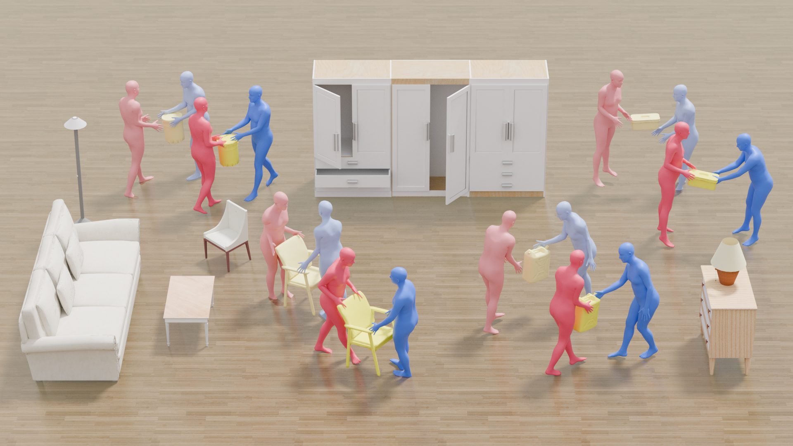
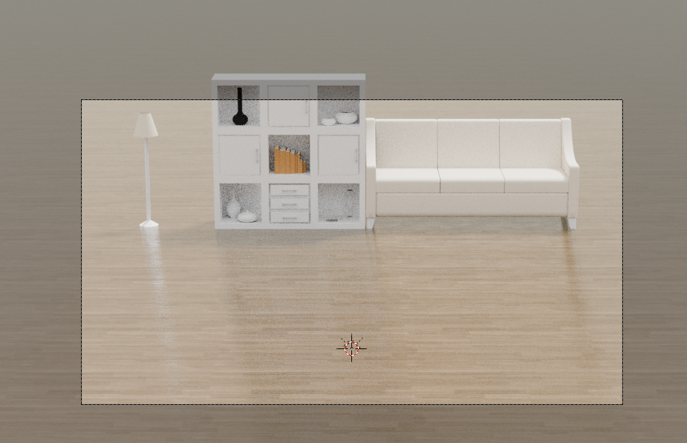
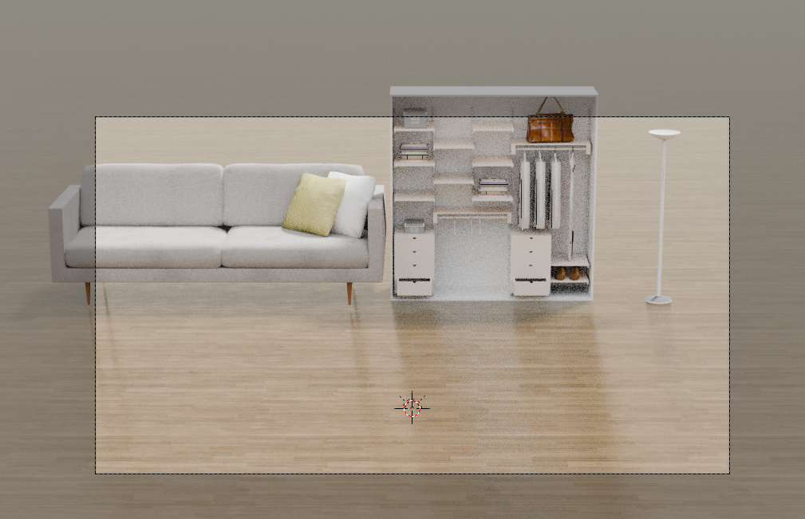
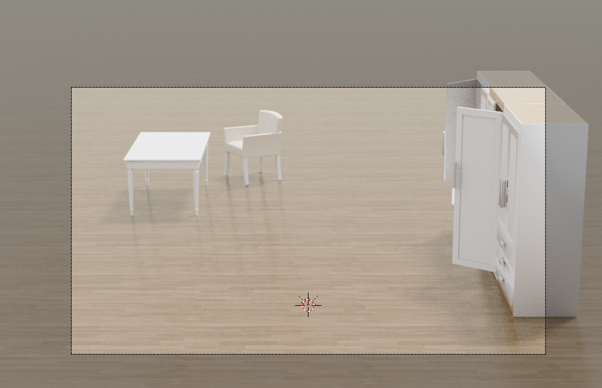
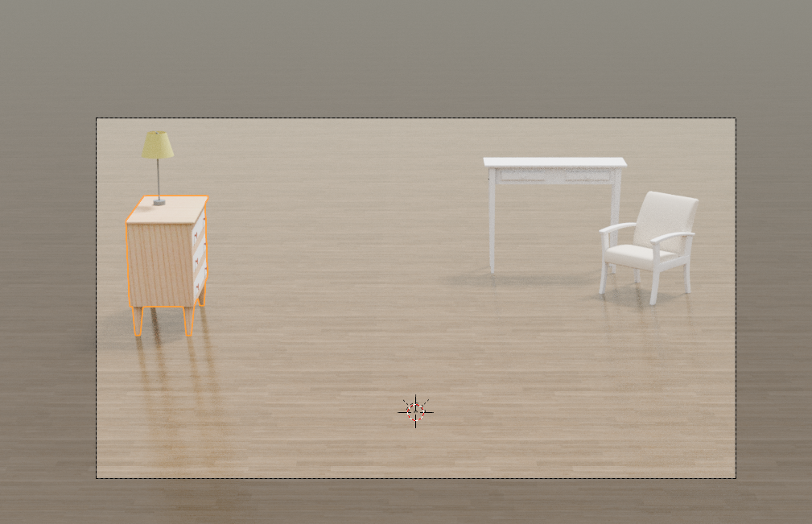

# Joint Positions to SMPL/PRIM Visualizer



## Dependencies
Create a micromamba env with the following command
```
micromamba env create -n newenv -f prepare/env.yaml
```

Prepare model files

```
bash prepare/download_smpl_files.sh
```

Download asset files from [here](https://drive.google.com/drive/folders/1MJUo716mliacY3s8sZgdoHS2oOTJUo-D?usp=drive_link),
should be located in `blender/asset`

Pleas check materials properly applied in `blender/scene.blender`


## Instruction

The following command will execute SMPLify, export to an obj file, and render a pkl file all at once.

```
python main.py -i data/sample.pkl
```

SMPL parameters and obj files will be stored in `cache` and `output` directories respectively. If these files already exist, the intermediate processing steps will be skipped.

### Command Line Arguments

| Flag | Description |
|------|-------------|
| `-i, --input` | Path to input .pkl file or data directory (required) |
| `-a, --ablation` | Enable ablation dataset rendering |
| `-g, --gt` | Enable GT dataset rendering |
| `-c, --camera` | Camera number (-1 for all cameras, default=-1) |
| `-sc, --scene` | Scene number (0 for no furniture, default=0) |
| `-s, --soft` | Enable soft material rendering |
| `-q, --high` | Enable high quality rendering settings |
| `-p, --prim` | Enable primitive rendering |


### Example Command
```
python main.py -i data/sample.pkl -c 1 -sc 1 -s -q -p
```
### Prepared Scenes

Scene 0: Empty room

Scene 1


Scene 2


Scene 3


Scene 4

